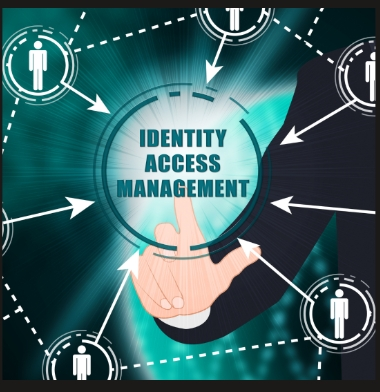

# Project Title
Northwind Services — Microsoft Entra ID Identity and Access Management Lab

## Project Overview

This project is a hands-on Microsoft Entra ID lab focused on designing and implementing a basic Identity and Access Management (IAM) environment for a small business. The goal is to replace shared accounts and informal access tracking with individual identities, structured groups, and a more manageable access-control model.

## Business Scenario

Northwind Services is a fictional 16-person company that previously relied on shared logins and a spreadsheet to track who had access to different resources. The company needed a properly structured Microsoft Entra ID environment with individual user accounts, department and role-based security groups, consistent naming conventions, and an access model based on least privilege.

## Tools Used

- Microsoft Entra ID

## What I Built

Created individual user accounts for the organization's employees and contractors.
Established a consistent First.Last naming convention for user principal names (UPNs).
Created security groups using the SEC-<Type>-<Name> naming convention.
Created department-based groups for Executive, Finance, HR, IT, Sales, and Contractors.
Created a role-based SEC-Role-Helpdesk group for users who require Helpdesk responsibilities.
Assigned users to groups based on their department and job responsibilities.
Created meaningful group descriptions identifying who belongs in each group and why the group exists.
Applied IAM principles such as least privilege, separation of responsibilities, and centralized access management.
Reviewed the group design and made adjustments to improve contractor access management and scalability.
Used Microsoft Entra ID audit logs to verify and document administrative changes made during the project.

## Screenshot

## Security Lessons Learned

One of the biggest things I learned from this project is that group-based access is a security control, not just a way to make administration easier. In my implementation, I created department groups such as SEC-Dept-Finance, SEC-Dept-HR, SEC-Dept-IT, SEC-Dept-Sales, and SEC-Dept-Executive. Instead of managing access individually for every user, these groups provide a consistent way to organize users and manage access based on their business responsibilities. I also created SEC-Role-Helpdesk separately because Helpdesk access is based on a specific job responsibility rather than simply being an IT employee. This showed me how separating department membership from specialized roles can support least privilege and make access easier to review.

The contractor group was another important lesson from my implementation. I created SEC-Dept-Contractor instead of treating contractors exactly like regular employees. This gives the organization a clear way to identify contractor accounts and review their access separately. A contractor may need access to resources for their work, but that does not mean they should automatically receive all of the access associated with a department. Separating contractors also makes it easier to identify accounts that may need to be disabled or have their access removed when a contract ends.

Overall, this project showed me that IAM design needs to consider both current access requirements and future access management. The groups I created work well for a 16-person organization, but I can see how the model would become more complicated as the company grows. If Northwind Services reached hundreds of employees, I would need more granular role- and resource-based groups, stronger access-review processes, and more automation. Designing the groups correctly early on makes that future transition easier and reduces the risk of access becoming difficult to govern.

## Future Improvements

-Replace manual group membership with dynamic membership driven by the department attribute.

-Add a naming convention for user accounts that distinguishes staff, contractors, and service accounts

-Script the user creation with PowerShell instead of the portal

-Export audit logs to external storage so retention is not capped at seven days

-Add an access review process so group membership gets checked periodically

-Add Multi-Factor Authentication (MFA) for users to provide an additional layer of protection beyond passwords.

-Establish formal group ownership so every security group has a clearly assigned person or team responsible for reviewing its membership and purpose

-Create a regular audit and cleanup process to identify inactive accounts, unnecessary group memberships, and accounts that no longer require access.

-Improve contractor lifecycle management by tracking contract end dates and establishing a process to remove or disable contractor access when the engagement ends.
